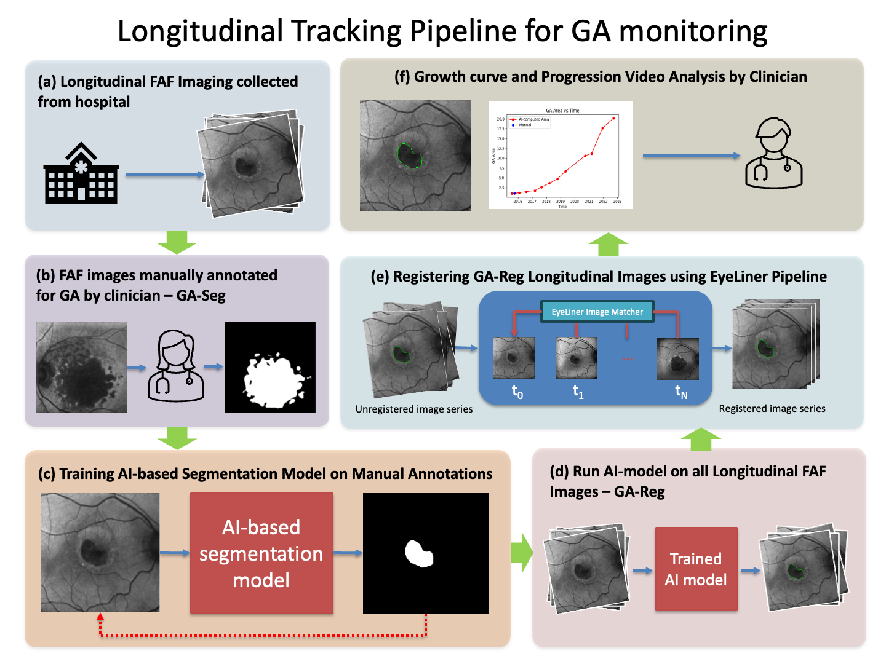

# GA Progression Modeling and Analysis using Deep Learning 

*Geographic atrophy (GA), an advanced form of age-related macular degeneration, is a leading cause of vision loss globally. Current approaches to monitor GA rely on manual examination of longitudinal imaging, which is time-consuming and subjective. This study presents a longitudinal tracking pipeline using AI-enabled segmentation and registration of fundus autofluorescence (FAF) images that allows for measurement of atrophic areas and visualization of disease progression.*



This repo contains all code required to execute our GA progression monitoring pipeline from FAF imaging.

## Acknowledgements

Some of the code in this project is adapted from other repositories, particularly the registration algorithm which uses weights from the [LightGlue](https://github.com/cvg/LightGlue?tab=readme-ov-file) repo and vessel segmentation from [vineet1992](https://github.com/vineet1992/Retina-Seg)'s vessel segmentation repo.

## Dependencies

Make sure you have [pyenv](https://github.com/pyenv/pyenv) and [poetry](https://python-poetry.org/) setup to run code. Clone the repo and execute the following:

```
pyenv virtualenv 3.10.4 ga_progression_modeling
poetry install
```

## How to Run on your data

In order to run our pipeline on your data, we require the imaging dataset to be provided as a CSV file containing the columns outlined in the config section below.

### Setup config

The config file in `src/configs/config.yaml` should store all the parameters for running the pipeline. The definitions of each parameter are provided below:

> Note: Do not edit the paths in the `models` section if you want to run the exact same models for segmentation and registration.

| Section | Parameter  | Definition | Default |
| ------------- | ------------- | ------------- | ------------- |
| `dataset` | `modality`  | Name of the image modality  | `Af` |
| `dataset` | `folder`  | Parent folder of csv data | `data/` |
| `dataset` | `csv_path` | CSV path relative to parent folder | `dataset.csv` |
| `dataset` | `image_col` | Column in CSV with image path| `file_path_coris` |
| `dataset` | `ga_col` | Column in CSV that contains or should contain the GA seg path | `file_path_ga_seg` |
| `dataset` | `vessel_col` | Column in CSV that contains or should contain the Vessel seg path | `file_path_vessel_seg` |
| `dataset` | `patient_id_col` | Column in CSV that contains patient ID | `PID` |
| `dataset` | `laterality_col` | Column in CSV that contains patient laterality (OD/OS eye) | `Laterality` |
| `dataset` | `modality_col` | Column in CSV that contains the modality name | `Procedure` |
| `dataset` | `examdate_col` | Column in CSV that contains the date of the image | `ExamDate` |
| `dataset` | `size_x_col` | Column in CSV that contains the X dimensionality of the modality image | `XSlo` |
| `dataset` | `size_y_col` | Column in CSV that contains the Y dimensionality  of the modality image | `YSlo` |
| `dataset` | `scale_x_col` | Column in CSV that contains the scale factor conversion in the X direction for the modality image | `Scale_X` |
| `dataset` | `scale_y_col` | Column in CSV that contains the scale factor conversion in the Y direction for the modality image | `Scale_Y` |
| `models` | `segmentation-ga-hist_eq` | Applies histogram equalization to the image as a pre-processing step | `True` |
| `models` | `segmentation-ga-weights` | Path to the weights for segmentation model | `src/weights/ga_seg/epoch=32-step=1023.ckpt` |
| `models` | `segmentation-vessel-hist_eq` | Applies histogram equalization to the image as a pre-processing step | `False` |
| `models` | `segmentation-vessel-weights` | Path to the weights for segmentation model | `weights/vessel_seg` |
| `models` | `registration-method` | Register images using `affine` or `tps` (thin-plate spline) | `affine` |
| `models` | `registration-input` | Register over `image` space or `vessel` space | `image` |
| `models` | `registration-reg2start` | Register all images to baseline? | `True` |
| `models` | `registration-tps` | Optional lambda parameter for thin-plate spline (if using thin-plate spline for `registration-method` ) | `1.` |
| `models` | `registration-size` | Size at which to register images | `256` |
| `models` | `device` | Device to run pipelines on | `cuda:0` |
| `results` | `folder` | Folder to create to save output. Will by default create a `results/` folder containing this sub-folder | `test` |

### Run `main.py`

After setting all the parameters in the config file, simply run `python src/main.py --config PATH_TO_CONFIG_FILE`

### Outputs

Running `src/main.py` will save output in the results folder specified in the config:

Main Output:
1. `images_processed.csv` : Processed data with segmentations and registrations saved in columns.
2. `longitudinal.pptx`: Powerpoint presentation with longitudinal image segmentations, registered videos, and growth curves.
3. `sequential.pptx`: Powerpoint presentation with each image segmentation indivitually shown.
4. `pipeline_files/images_1.csv` : Subset of the raw data csv, which contains all the rows for the specific modality. 
5. `pipeline_files/images_2.csv` : Same as `images_1.csv` but with paths to the GA segmentation and Vessel segmentation included in columns.
6. `pipeline_files/images_3.csv` : Same as `images_2.csv` but with GA areas computed and added in as an extra column.
7. `pipeline_files/images_4.csv` : Same as `images_3.csv` but with paths to the registration parameters saved in the columns.
8. `pipeline_files/segmentations/ga/`: Contains all the segmentations of GA in the images.
9. `pipeline_files/segmentations/vessels/`: Contains all the segmentations of vessels in the images.
10. `pipeline_files/registrations/registration_logs/`: Contains all the log files for registrations.
11. `pipeline_files/registrations/registration_params/`: Contains all the parameter files for registrations. These are saved as `.pth` files.
12. `pipeline_files/registrations/registration_keypoint_matches/`: Contains visuals of the keypoint matches between images found during registrations.
13. `pipeline_files/presentations/longitudinal/`: Contains all metadata for generating `longitudinal.pptx`
14. `pipeline_files/presentations/sequential/`: Contains all metadata for generating `sequential.pptx`

<!-- #### 2. Perform Gompertz Analysis (To be done separately using Aaron Beckwith's code)

#### 3. `src/bash_scripts/pipeline_gompertz.sh`

1. Joins gompertz data from pipeline 2 with the output csv from pipeline 1.
2. Joins additional metadata such as patient dob, PRS codes etc.
3. Creates a final powerpoint of the results. -->